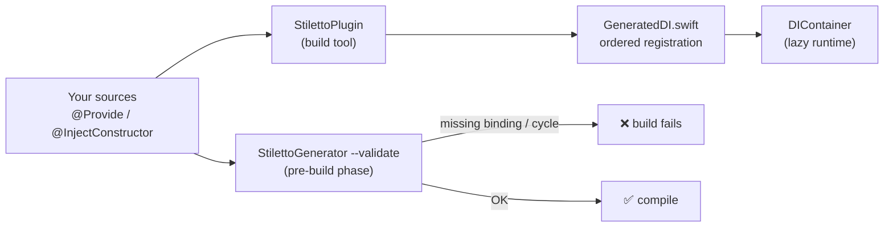

# Stiletto 🗡️

[](https://swiftpackageindex.com/henrydavl/StilettoSwift)
[](https://swiftpackageindex.com/henrydavl/StilettoSwift)

**Compile-time-checked dependency injection for Swift** — annotate your implementations, and the build figures out the rest.

A *stiletto* is a slender dagger: this library brings the [Dagger](https://dagger.dev)/[Hilt](https://dagger.dev/hilt/) experience to Swift. Forgetting to register a dependency **fails your build** with a clear error — it never crashes at runtime. Registration order is computed for you. Moving a class between modules requires zero DI bookkeeping.

```swift
import Stiletto

@Provide(GreeterProtocol.self, scope: .session)
@InjectConstructor
final class Greeter: GreeterProtocol {
    private let clock: ClockProtocol
    init(clock: ClockProtocol) { self.clock = clock }
}
```

That's it. No registration call, no ordering, no module file.

## Why

Swift macros see one declaration at a time, so a macro alone can never tell you *"you forgot to register `ClockProtocol`."* Stiletto pairs macros with a **build-time source scanner** (SwiftSyntax) that sees the whole graph:

| Layer | Runs | Does |
|---|---|---|
| `@Provide` / `@InjectConstructor` macros | per declaration | synthesize type-safe registration & constructor resolution |
| `StilettoPlugin` (build-tool plugin) | per target | scans sources, **topo-sorts** bindings, emits `GeneratedDI.register()` |
| `StilettoGenerator --validate` | whole program | validates **every** edge across **all** modules — missing binding or cycle ⇒ build error |



## Installation

```swift
dependencies: [
    .package(url: "https://github.com/henrydavl/StilettoSwift.git", from: "0.1.1")
]
```

Attach to each target that declares bindings. The `package:` argument is the
package **identity** — for a URL dependency that's the repo name (`StilettoSwift`),
not the library product name (`Stiletto`):

```swift
.target(
    name: "MyModule",
    dependencies: [.product(name: "Stiletto", package: "StilettoSwift")],
    plugins: [.plugin(name: "StilettoPlugin", package: "StilettoSwift")]
)
```

## Usage

### Bind an implementation to a protocol

```swift
@Provide(HeaderProviderProtocol.self, scope: .session)
@InjectConstructor
public final class DefaultHeaderProvider: HeaderProviderProtocol {
    public init(session: SessionManagerProtocol) { ... }
}
```

### Bind a concrete class to itself

Use the no-argument form (passing the class's own type as an argument would be a circular reference):

```swift
@Provide(scope: .factory)
@InjectConstructor
public final class InquiryUserUseCase {
    public init(repository: UserRepositoryProtocol) { ... }
}
```

### Scopes

| Scope | Lifetime |
|---|---|
| `.singleton` | one instance for the app's lifetime (lazy) |
| `.session` | one instance until `DIContainer.shared.clearSession()` (lazy) |
| `.factory` | new instance on every resolve |

### Kick off registration

Each target's generated code is an **internal** `GeneratedDI` (so multiple modules never collide). Expose it once per module:

```swift
public enum MyModuleDI {
    public static func register() { GeneratedDI.register() }
}
```

Then at app startup, call each module's `register()` — **in any order**. Registration is lazy (factories only), so ordering never matters at runtime; the generator's topo-sort plus whole-program validation guarantee the graph is complete and acyclic before the app ever runs.

### Resolve

```swift
let useCase = resolve(InquiryUserUseCase.self)          // free function
let header = DIContainer.shared.resolve(HeaderProviderProtocol.self)

final class SomeViewModel {
    @Inject private var repo: UserRepositoryProtocol     // eager, at init
    @LazyInject private var tracker: TrackerProtocol     // on first access
}
```

> ⚠️ `@Inject` / `@LazyInject` **properties** are resolved at runtime and are *not* part of the compile-time-validated graph. Prefer `@InjectConstructor`.

### Mixing injected deps with SDK / runtime values

Initializer parameters **with a default value are skipped** — they keep their default and are neither resolved nor validated:

```swift
@Provide(AnalyticsProtocol.self, scope: .singleton)
@InjectConstructor
final class AnalyticsHelper: AnalyticsProtocol {
    init(
        userRepo: UserRepositoryProtocol,                 // ← injected
        sdk: ThirdPartySDK = ThirdPartySDK.shared()       // ← keeps its default
    ) { ... }
}
```

For values with no sensible default (e.g. a `UIScene` only known at runtime), bundle the injectable deps into a `@Provide @InjectConstructor` holder and pass it alongside: `MyCoordinator(scene: scene, deps: .auto)`.

### Manual escape hatches

```swift
// A value built from a third-party type you can't annotate:
@Provides(scope: .singleton) var payments: PaymentSDKProtocol = PaymentSDKAdapter()

// Types provided outside scanned sources (rarely needed):
enum MyExternals { static let external: [Any.Type] = [LegacyThing.self] }
```

The validator recognizes both as satisfied bindings.

## Whole-program validation

The plugin validates each target in isolation but deliberately ignores **cross-module** edges (module A may depend on a binding provided in module B). Add one pre-build step that scans every source root:

```bash
swift run --package-path <path-to-stiletto-checkout> StilettoGenerator \
    --validate Sources/ App/
```

**Xcode app target:** add a Run Script phase *before* Compile Sources. When Stiletto is consumed as an SPM dependency (the usual case), `StilettoGenerator` lives in Xcode's resolved package checkout — use this script, which locates it robustly for **both normal and Archive builds**:

```bash
# Whole-program DI graph validation. Fails the build if any
# @Provide/@InjectConstructor dependency is unsatisfied across the whole app.
unset SDKROOT   # mandatory: the phase inherits the iOS SDK, which breaks `swift run`

# Anchor on the DerivedData root (everything before the first /Build/). This is
# identical for normal AND Archive builds; BUILD_DIR itself points inside
# .../ArchiveIntermediates/<scheme>/BuildProductsPath during an archive, so a
# naive `${BUILD_DIR%/Build/Products*}` strip resolves to a path that does not
# exist and the phase fails with "(l)stat: No such file or directory".
DERIVED_ROOT="${BUILD_DIR%%/Build/*}"
CHECKOUT="$DERIVED_ROOT/SourcePackages/checkouts/StilettoSwift"
if [ ! -d "$CHECKOUT" ]; then
    CHECKOUT="$(find "$DERIVED_ROOT" -maxdepth 6 -type d -path '*/SourcePackages/checkouts/StilettoSwift' 2>/dev/null | head -1)"
fi
if [ ! -d "$CHECKOUT" ]; then
    echo "warning: StilettoSwift checkout not found under $DERIVED_ROOT; skipping whole-program validation (per-target validation still ran)"
    exit 0
fi

# Copy the tool sources aside so building the generator never dirties the
# read-only package checkout.
TOOLS="${OBJROOT}/StilettoTools"
mkdir -p "$TOOLS/src"
rsync -a --delete --exclude .git --exclude Package.resolved "$CHECKOUT/" "$TOOLS/src/"
swift run --package-path "$TOOLS/src" --scratch-path "$TOOLS/build" StilettoGenerator \
    --validate "$SRCROOT/Modules" "$SRCROOT/MyApp"
```

> Replace `StilettoSwift` with your package's repo folder name (it's whatever the
> last path component of your `.package(url:)` is, minus `.git`), and point
> `--validate` at your own source roots.

If you instead **vendor Stiletto as a local package** (`.package(path: …)`), the checkout dance isn't needed — just run it from your local copy:

```bash
unset SDKROOT
swift run --package-path "$SRCROOT/path/to/Stiletto" StilettoGenerator \
    --validate "$SRCROOT/Modules" "$SRCROOT/MyApp"
```

Also attach the plugin to the app target itself via **Build Phases → Run Build Tool Plug-ins → + StilettoPlugin**.

A missing binding then fails the build like:

```
error: DI graph: AnalyticsHelper requires 'UserRepositoryProtocol', which is not
provided by any @Provide (or @Provides) in the program.
```

Because validation sees *every* provider in the program, moving a class between modules needs **no** DI changes at all.

## Example

A complete runnable graph lives in [`Sources/StilettoExample`](Sources/StilettoExample):

```bash
swift run StilettoExample
```

## Logging

Silent by default. Plug in your logger:

```swift
DIContainer.logHandler = { print("🗡️ \($0)") }
```

## Limitations

- Only `@InjectConstructor` **constructor** parameters participate in compile-time validation; `@Inject`/`@LazyInject` properties resolve at runtime.
- `@Provide` applies to classes (reference semantics for shared scopes).
- One initializer per class is considered (the first declared).

## License

MIT — see [LICENSE](LICENSE).
